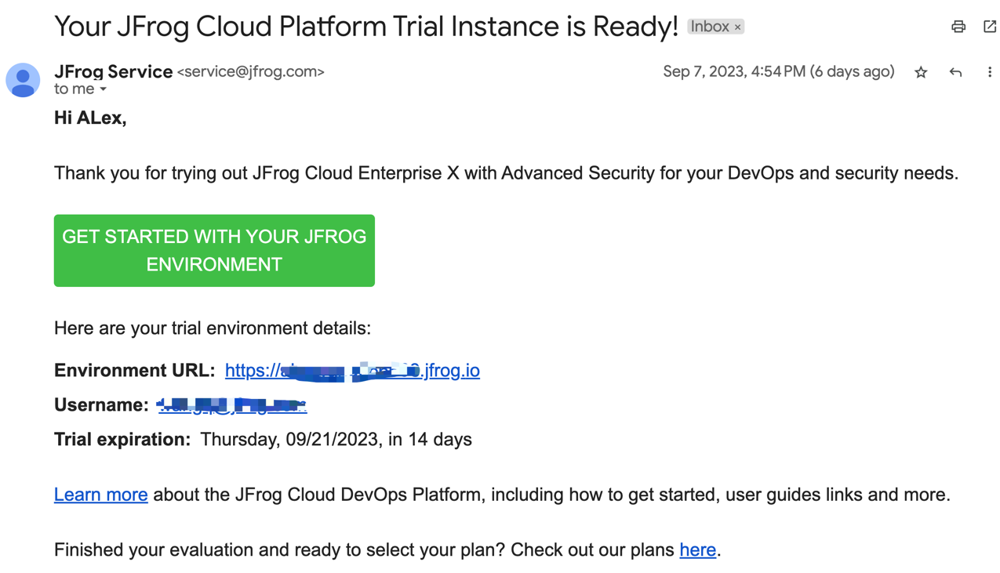
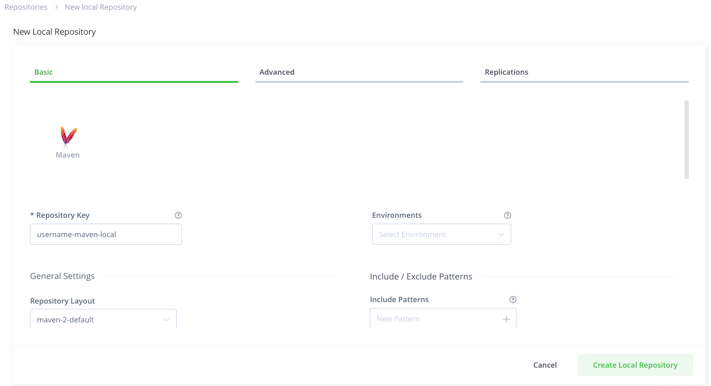
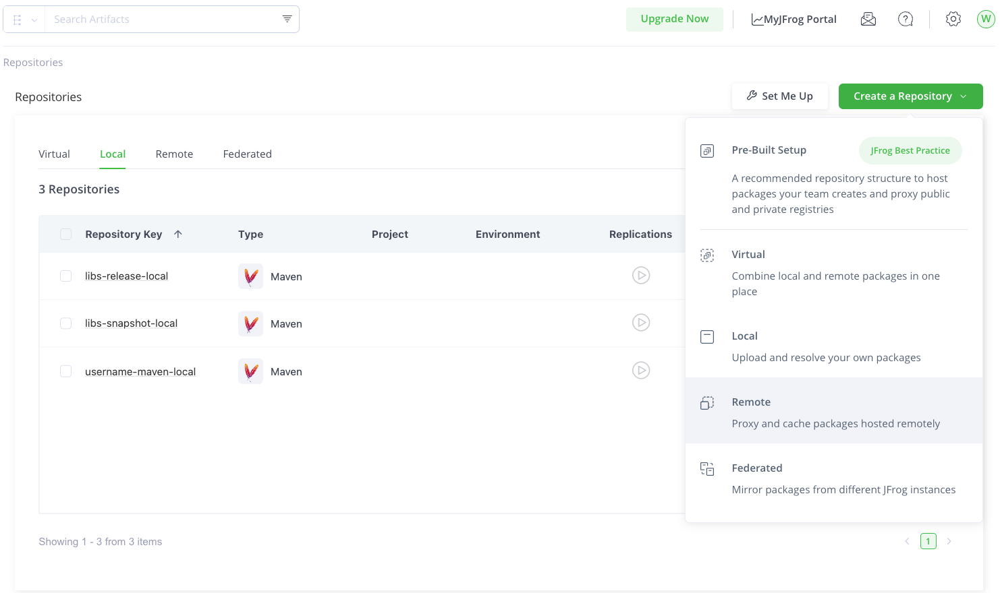
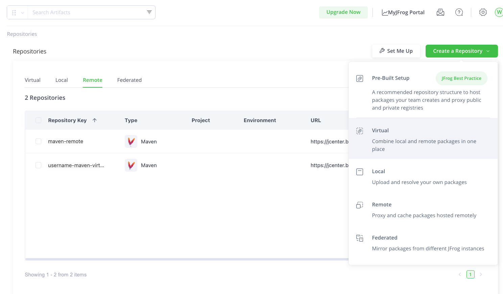
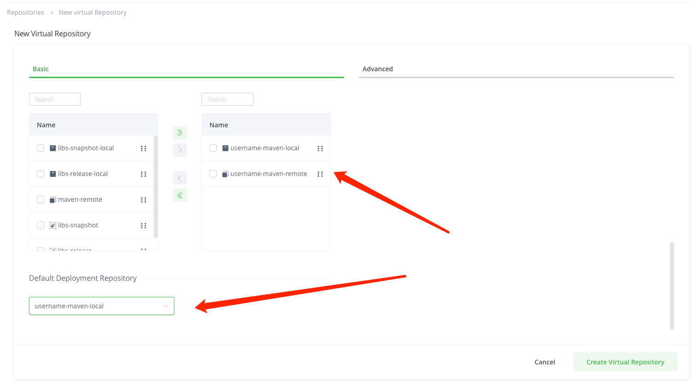

# Workshop Guide


## 实验目标
1. 开发者在JFrog Artifactory配置仓库进行构建。
2. 开发者进行maven构建，通过Artifactory进行依赖下载。
3. 开发者将构建包上传到Artifactory，并进行漏洞扫描。
4. 开发者将构建的jar包放入docker镜像并构建镜像。
5. 扫描docker镜像，配置漏洞扫描策略，阻止超高危漏洞的下载。
        
## 准备
1. 获取Artifactory 账号 
- 访问：https://jfrog.com/start-free/
- 使用公司邮箱进行注册，注册后会收到一封确认邮件：

- 点击Environment URL并设置初始密码，即可开始使用。

2. 获取实验代码
```shell
git clone git@github.com:JFrogChina/training.git
```

## 实验 1 - maven build 
可参考：https://jfrog.com/help/r/get-started-with-the-jfrog-platform/quickstart-guide-maven-and-gradle

1. 创建并配置Maven仓库。 
请将username替换为自己的用户名
- 在Artifactory中创建Maven local 仓库，命名为：username-maven-local。

- 在Artifactory中创建Maven remote 仓库，命名为：username-maven-remote。

- 在Artifactory中创建Maven virtual 仓库，命名为：username-maven-virtual。


- 配置virtual仓库包含username-maven-local，和username-maven-remote。
- 配置virtual仓库的deploy repository为username-maven-local。


2. 安装JFrog CLI
- 下载JFrog CLI
- 配置jf c
- 配置jf mvnc连接Maven仓库
3. 执行Maven构建
- 使用jf mvn deploy --build-name=username-maven --build-number=1
4. 在Artifactory里查看制品和build info

## 实验 2 - Xray扫描Maven漏洞并修复
1. 配置xray 索引maven仓库username-maven-local
2. 点击index now立刻出发索引
3. 在xray->scan list里查看扫描结果，找到log4j-core:1.14.0版本的高危漏洞
4. 在training/01-Java-Package-Security-Scanning/demo-log4j/pom.xml中将log4j-core版本升级为1.16.0
```shell
		<dependency>
			<groupId>org.apache.logging.log4j</groupId>
			<artifactId>log4j-core</artifactId>
			<version>2.14.0</version>
		</dependency>
```
更改为：
```shell
		<dependency>
			<groupId>org.apache.logging.log4j</groupId>
			<artifactId>log4j-core</artifactId>
			<version>2.16.0</version>
		</dependency>
```
- 重新执行jf mvn deploy --build-name=username-maven --build-number=2
- 在xray->scan list中查看新版本中log4j漏洞是否修复。

## 实验3 构建Docker镜像
- 创建Docker local，remote，virtual镜像仓库，分别命名为username-docker-local,username-docker-remote,username-docker-virtual.
- 配置username-docker-virtual,仓库包含 username-docker-local, 和username-docker-remote仓库。
- 配置username-docker-virtual的deployment repository为username-docker-local。
- 执行docker构建：
```shell
docker login your-account.jfrog.io
docker tag docker-app your-account.jfrog.io/username-docker-virtual/docker-app
docker push your-account.jfrog.io/username-docker-virtual/docker-app
```
## 实验4 扫描Docker镜像，在Xray中查看扫描结果
