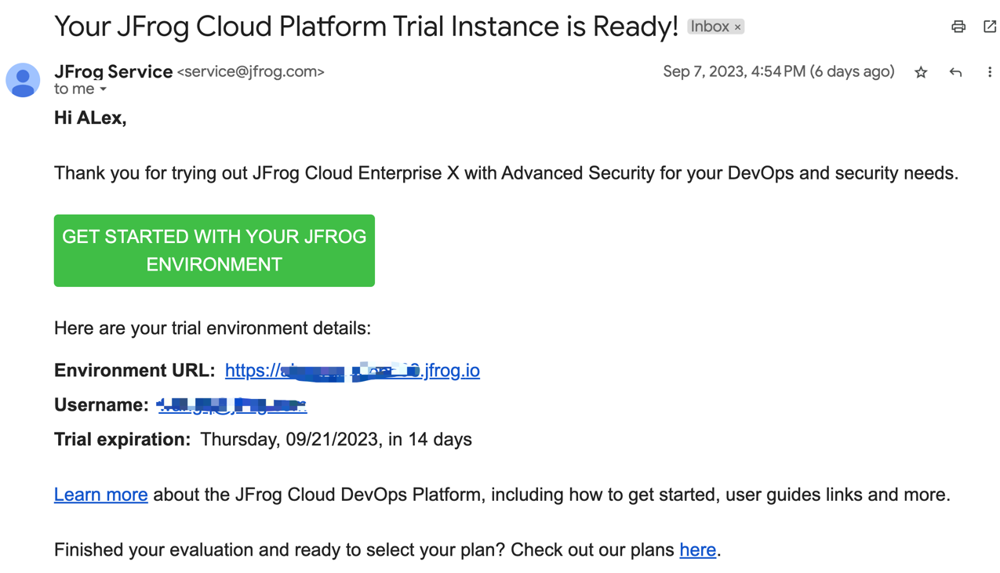
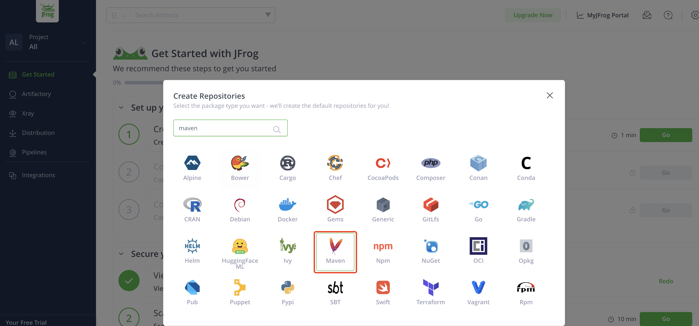
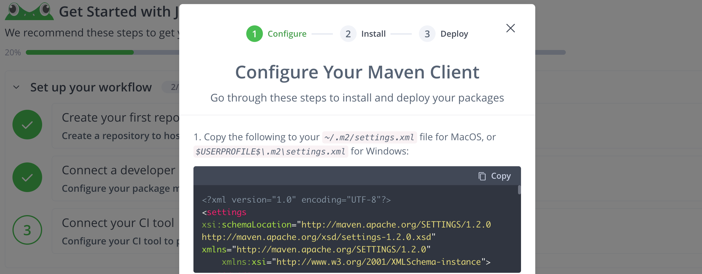
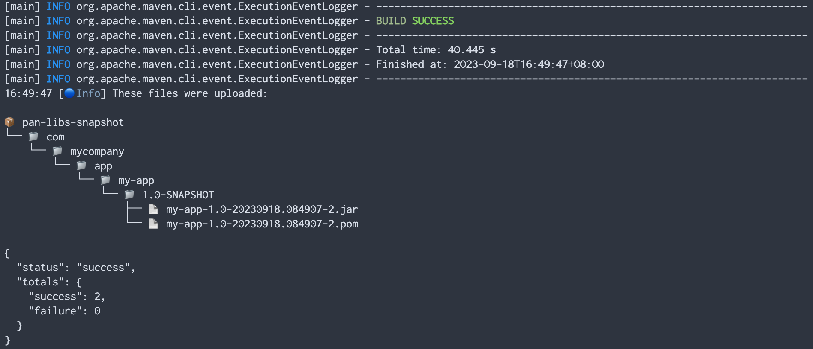
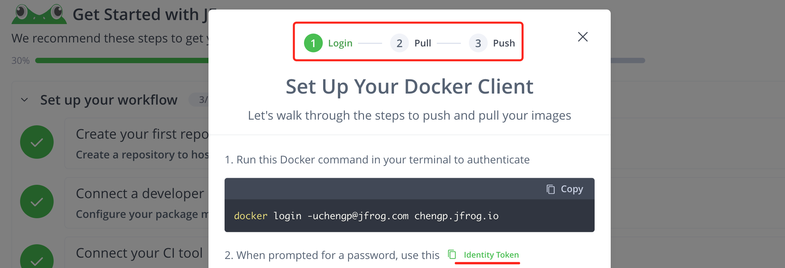
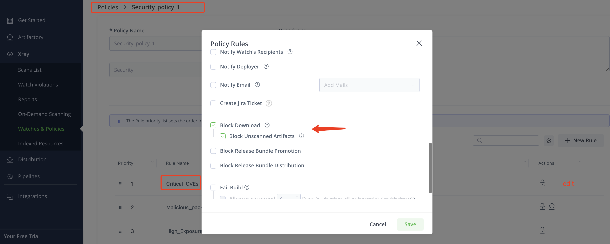

# Workshop Guide

## 实验过程
1. 开发者通过申请JFrog Platform 云环境快速完成环境准备。
2. 测试 Maven 构建集成 JFrog Platform 的 workflow。
   - 执行 Maven 构建，通过 JFrog Artifactory 进行依赖下载。
   - 将构建产出物上传到 JFrog Artifactory ，并进行漏洞扫描。
3. 测试通过 JFrog CLI tool 进行 Maven 构建集成。
   - 执行构建，并上传和收集构建信息至 JFrog Artifactory。
   - 对构建进行漏洞扫描，并尝试修复漏洞。
4. 测试 Docker 构建集成 JFrog Platform 的 workflow。
   - 将构建的 Jar 包放入 Docker 镜像。
   - 扫描 Docker 镜像，配置漏洞扫描策略，阻止超高危漏洞的下载。
        
## 准备
### 申请 JFrog Platform 云环境 
1. 访问：[https://jfrog.com/start-free/]()，使用您的公司邮箱进行注册。
2. 填写相关信息申请云环境，建议您选择就近的Cloud Region。
3. 提交申请后会收到一封确认邮件，点击Environment URL并设置初始密码，即可开始使用。


> 此环境JFrog将为您保留14天。

### 本地环境
在您的个人电脑或者构建服务器上预先安装好所需工具
-  JDK >= 1.8
-  Maven >= 3.5.3
-  Docker Client >= 20.10.6

## 实验 1 - Maven build integration


1. 访问您申请的云环境，在 **Get Started** 栏目选择 Maven Package 类型进行仓库的创建

2. 您将看到指引程序会自动创建所需的仓库类型，有关仓库类型介绍，您可参考[官方文档](https://jfrog.com/help/r/jfrog-artifactory-documentation/repository-management)。
3. 创建完成后，点击`I'll do it later`会跳转到您所创建的仓库列表栏目
4. 点击 Remote 标签页，点击您创建的 Maven 远程仓库，将 URL 修改为`https://repo1.maven.org/maven2/`并保存([Jcenter Sunset](https://jfrog.com/blog/into-the-sunset-bintray-jcenter-gocenter-and-chartcenter/))。
5. 返回 **Get Started** 栏目，跟随指引程序完成第二步 Maven Package 的构建和上传。

6. 之后您可以在 **Artifacs** 栏目浏览所上传的制品。
> 您也可以点击 Redo 跟随指引尝试不同 Package 类型的构建集成。
## 实验 2 - JFrog CLI intergration
> 执行第三步Connect your CI tool，选择 Other CI，之后您将获取到JFrog CLI 的文档链接。您也可以尝试其他 CI tools 的集成。
1. 直接下载您操作系统对应的jf二进制程序，[下载地址](https://releases.jfrog.io/artifactory/jfrog-cli/v2-jf/2.48.0/)。
2. 以 Linux 操作系统为例，直接将该程序授权并加入PATH
```sh
wget https://releases.jfrog.io/artifactory/jfrog-cli/v2-jf/2.48.0/jfrog-cli-linux-amd64/jf
chmod +x jf
mv jf /usr/local/bin/
```
3. 交互式配置 jf 工具连接 JFrog Artifactory:


4. 交互式配置 jf 工具连接 Artifactory Maven 虚拟仓库:


5. 通过 jf 工具执行 Maven 构建：
```sh
cd my-app
jf mvn clean install --build-name maven-demo --build-number 1.0
jf rt bp maven-demo 1.0 # 此处需要和上面构建时的build对应
```

6. 在 Artifactory 查看制品和 Build info：


## 实验 3 - 使用 Xray 扫描 Maven 漏洞并修复
1. 返回 **Get Started** 栏目，之后点击 View scan results 可以查看指定仓库内的制品的漏洞信息
2. 修改示例项目的 POM 文件，添加以下 dependency ：
```xml
		<dependency>
			<groupId>org.apache.logging.log4j</groupId>
			<artifactId>log4j-core</artifactId>
			<version>2.14.0</version>
		</dependency>
```
3. 继续修改 POM 文件，直接替换 build 节点中的内容，将依赖的 jar 一并打包：
```xml
    <build>
        <plugins>
            <plugin>
                <groupId>org.apache.maven.plugins</groupId>
                <artifactId>maven-assembly-plugin</artifactId>
                <version>3.3.0</version>
                <configuration>
                    <archive>
                        <manifest>
                            <mainClass>com.mycompany.app.App</mainClass>
                        </manifest>
                    </archive>
                    <descriptorRefs>
                        <descriptorRef>jar-with-dependencies</descriptorRef>
                    </descriptorRefs>
                </configuration>
                <executions>
                    <execution>
                        <id>make-assembly</id>
                        <phase>package</phase>
                        <goals>
                            <goal>single</goal>
                        </goals>
                    </execution>
                </executions>
            </plugin>
        </plugins>
    </build>
```
4. 将前面上传的 Build 加入 Xray Index 和 Watch 并保存。此设置可以让 Xray 自动扫描我们上传的构建信息


5. 通过 jf 工具执行 Maven 构建
```sh
cd my-app
jf mvn clean install --build-name maven-demo --build-number 1.1
jf rt bp maven-demo 1.1 # 此处需要和上面构建时的build对应
```
6. 在 **Artifactory -> Builds** 或**Scan List -> Builds** 查看扫描结果，找到log4j-core:2.14.0版本的高危漏洞


7. 根据修复提示，将示例项目的 POM 文件的 log4j-core版本升级为2.16.0
```shell
		<dependency>
			<groupId>org.apache.logging.log4j</groupId>
			<artifactId>log4j-core</artifactId>
			<version>2.16.0</version>
		</dependency>
```
8. 修改构建号，重新执行 JFrog CLI 构建，此时致命漏洞已经修复：


## 实验 4 - Docker build intergration

1. 在 **Get Started** 栏目点击`Redo`选择 Docker Package 类型进行仓库的创建
2. 创建完成后，点击`Continue`，之后选择`Docker Client`方式进行集成。
3. 跟随指引程序完成第二步 Docker Package 的拉取和推送。

> 注意，需要跟随步骤完成后，页面才可以点击`Next`。

## 实验 5 - 使用 Xray 阻断 Docker 镜像构建
1. 将示例项目的 POM 文件的 log4j-core版本降级为2.14.0，并重新打包构建
2. 使用以下 Dockerfile，用来制作带有漏洞的基础镜像
```Dockerfile
FROM <yourname>.jfrog.io/<prefix>-docker/busybox
COPY target/my-app-1.0-SNAPSHOT-jar-with-dependencies.jar /tmp
```
3. 制作镜像，并推送到 Docker 仓库
```sh
docker build -t <yourname>.jfrog.io/<prefix>-docker/base-image:1.0 .
docker push <yourname>.jfrog.io/<prefix>-docker/base-image:1.0
```
4. 修改全局策略阻断致命级别漏洞的制品下载，并保存


5. 再次尝试拉取该镜像，观察结果
```sh
docker pull <yourname>.jfrog.io/<prefix>-docker/base-image:1.0
```

